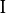
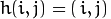

# Remapping

使用OpenCV函数 [remap](http://opencv.willowgarage.com/documentation/cpp/imgproc_geometric_image_transformations.html?#remap) 来实现简单重映射。

## 原理

### 重映射是什么

- 把一个图像中一个位置的像素放置到另一个图片指定位置的过程.

- 为了完成映射过程, 有必要获得一些插值为非整数像素坐标,因为源图像与目标图像的像素坐标不是一一对应的.

- 我们通过重映射来表达每个像素的位置  :

  

  这里  是目标图像,  是源图像,  是作用于  的映射方法函数.

- 让我们来思考一个快速的例子. 想象一下我们有一个图像  , 我们想满足下面的条件作重映射:

  

  会发生什么? 图像会按照  轴方向发生翻转. 例如, 源图像如下:

    

  看到红色圈关于 x 的位置改变(  轴水平翻转):

   

- 通过 OpenCV 的函数 [remap](http://opencv.willowgarage.com/documentation/cpp/imgproc_geometric_image_transformations.html?#remap) 提供一个简单的重映射实现.

## 代码解释

1. 首先准备程序用到的变量:

   ```c++
   Mat src, dst;
   Mat map_x, map_y;
   char* remap_window = "Remap demo";
   int ind = 0;
   ```

2. 加载一幅图像:

   ```c++
   src = imread("cat.jpg" argv[1]"", 1 );
   ```

3. 创建目标图像和两个映射矩阵.( x 和 y )

   ```c++
   dst.create( src.size(), src.type() );
   map_x.create( src.size(), CV_32FC1 );
   map_y.create( src.size(), CV_32FC1 );
   ```

4. 创建一个窗口用于展示结果.

   ```c++
   namedWindow( remap_window, CV_WINDOW_AUTOSIZE );
   ```

5. 建立一个间隔1000毫秒的循环,每次循环执行更新映射矩阵参数并对源图像进行重映射处理(使用 *mat_x* 和 *mat_y*),然后把更新后的目标图像显示出来:

   ```c++
   while( true )
   {
   
     int c = waitKey( 1000 );
   
     if( (char)c == 27 )
       { break; }
   
     update_map();
     remap( src, dst, map_x, map_y, CV_INTER_LINEAR, BORDER_CONSTANT, Scalar(0,0, 0) );
   
     imshow( remap_window, dst );
   }
   ```

   上面用到的重映射函数 [remap](http://opencv.willowgarage.com/documentation/cpp/imgproc_geometric_image_transformations.html?#remap). 参数说明:

   - **src**: 源图像
   - **dst**: 目标图像，与 *src* 相同大小
   - **map_x**: x方向的映射参数. 它相当于方法  的第一个参数
   - **map_y**: y方向的映射参数. 注意 *map_y* 和 *map_x* 与 *src* 的大小一致。
   - **CV_INTER_LINEAR**: 非整数像素坐标插值标志. 这里给出的是默认值(双线性插值).
   - **BORDER_CONSTANT**: 默认

   如何更新重映射矩阵 *mat_x* 和 *mat_y*? 请继续看:

6. **更新重映射矩阵:** 我们将分别使用4种不同的映射:

   1. 图像原始状态: 
   2. 图像上下颠倒: 
   3. 图像左右颠倒: 
   4. 同时执行b和c的操作: 

下面的代码片段说明上述的映射过程. 在这里 *map_x* 代表第一个坐标 *h(i,j)* , *map_y* 是第二个坐标.

```c++
for (int j = 0; j < src.rows; j++)
{
	for (int i = 0; i < src.cols; i++)
	{
		switch (ind)
		{
		case 0:
			map_x.at<float>(j, i) = i;
			map_y.at<float>(j, i) = j;
			break;
		case 1:
			map_x.at<float>(j, i) = i;
			map_y.at<float>(j, i) = src.rows - j;
			break;
		case 2:
			map_x.at<float>(j, i) = src.cols - i;
			map_y.at<float>(j, i) = j;
			break;
		case 3:
			map_x.at<float>(j, i) = src.cols - i;
			map_y.at<float>(j, i) = src.rows - j;
			break;
		}
	}
}
```